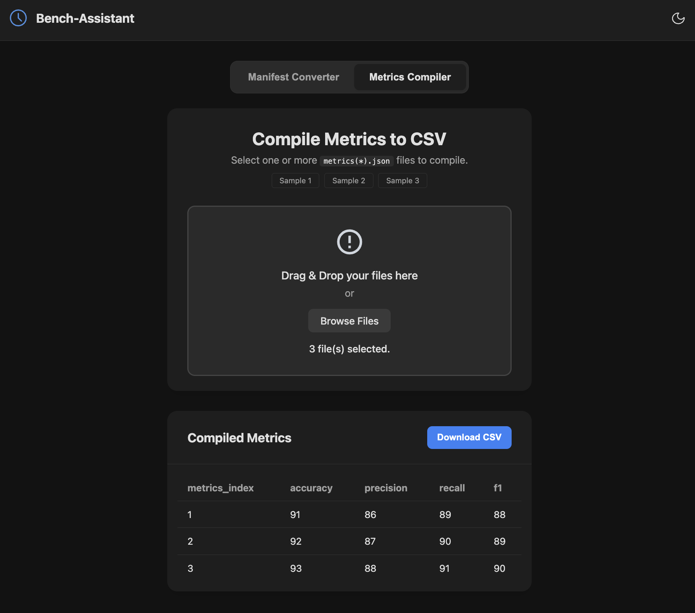

# 📊 Bench-Assistant (벤치마크 어시스턴트)

> **성능 평가 및 실험 데이터 분석 효율화를 위한 데이터 변환 도구**
>
> 🚀 **실시간 서비스 접속:** [https://bench-assistant.pages.dev/](https://bench-assistant.pages.dev/)

---

## 📺 프로젝트 시연
> **Note:** 아래는 실제 동작 화면입니다.

사내 성능 검증(Performance Validation) 프로세스에서 발생하는 복잡한 JSON 데이터를 쉽고 빠르게 분석 가능한 CSV 형식으로 변환해주는 웹 서비스입니다. 실험 결과 매니페스트와 개별 지표 파일들을 수동으로 정리하는 번거로움을 최소화하고, 즉각적인 수치 확인과 리포트 생성을 돕습니다.

---

## 🛡️ 프로젝트 배경 및 목적

*   **데이터 가시성 확보:** 복잡한 계층 구조의 `manifest.json`에서 핵심 성능 지표(Accuracy, Precision 등)를 추출하여 한눈에 파악할 수 있게 합니다.
*   **학습 효율 측정:** 각 실험 시퀀스별 시작 시각과 종료 시각을 바탕으로 실제 학습 시간(`train_Time`)을 자동 계산합니다.
*   **실험 결과 통합:** 여러 폴더에 분산된 다수의 `metrics.json` 파일들을 하나의 테이블로 병합하여 비교 분석을 용이하게 합니다.
*   **유연한 워크플로우:** 파일 확장자에 구애받지 않는 스마트 핸들링을 통해 실무 환경에서의 데이터 처리 속도를 높입니다.

---

## ✨ 주요 기능

- **Manifest Converter (탭 1):** `manifest.json`을 로드하여 각 실험 항목별 지표 추출 및 CSV 변환.
- **Metrics Compiler (탭 2):** 여러 개의 지표 파일을 한 번에 업로드하여 통합 리스트 생성 및 CSV 다운로드.
- **스마트 지표 추출:** `test/` 또는 `valid/` 접두사에 관계없이 핵심 지표(Accuracy, Precision, Recall, F1)를 자동 매칭.
- **샘플 데이터 제공:** 10개 행의 테스트용 매니페스트 및 다중 지표 샘플 파일을 버튼 클릭으로 즉시 다운로드 가능.
- **다크 모드 최적화:** 장시간 데이터 분석 시 눈의 피로를 줄여주는 다크 모드 기본 테마 적용.

---

## 🚀 배포 환경

이 프로젝트는 최신 CI/CD 환경에서 운영됩니다.

- **Infrastructure:** [Cloudflare Pages](https://pages.cloudflare.com/)
- **Live URL:** [https://bench-assistant.pages.dev/](https://bench-assistant.pages.dev/)
- **Deployment:** `main` 브랜치에 코드 Push 시 Cloudflare를 통해 자동으로 빌드 및 글로벌 에지 네트워크에 배포됩니다.

---

## 🛠 기술 스택

- **Frontend:** HTML5, CSS3, Vanilla JavaScript
- **Deployment:** Cloudflare Pages
- **Typography:** Pretendard (Lineage of Apple SD Gothic Neo)

---

## 📄 라이선스
이 프로젝트는 MIT 라이선스 하에 배포됩니다.
